> {width="3.0829166666666667in"
> height="0.8694444444444445in"}
>
> **[BUSINESS ANALYTICS]{.underline} [TOOLKIT PORTFOLIO]{.underline}**

**Banner ID:** B00966750

**Name:** Karthikeyan Kandan

**Professor:** Kyung Lee

# 

[**Chapter 1 Microsoft Excel Pivot
Table**](#chapter-1-microsoft-excel-pivot-table) **3**

> [1.1 About Microsoft Excel Pivot
> Table](#about-microsoft-excel-pivot-table) 3
>
> [1.2 Dataset and Research Questions](#dataset-and-research-questions)
> 3
>
> [1.3 Applying the analytical tool and
> results](#applying-the-analytical-tool-and-results) 4
>
> [1.3.1 Which quarter of the fiscal year has generated its highest
> revenue, and which month tops in that particular
> quarter?](#which-quarter-of-the-fiscal-year-has-generated-its-highest-revenue-and-which-month-tops-in-that-particular-quarter)
> 4
>
> [1.3.2 What is the average Revenue per
> customer??](#what-is-the-average-revenue-per-customer) 4
>
> [1.3.3 Based on the dataset, which country has generated the least
> revenue in the latest
> year?](#based-on-the-dataset-which-country-has-generated-the-least-revenue-in-the-latest-year)
> 5
>
> [1.3.4 Which division has the lowest revenue in the year with the
> highest
> revenue?](#which-division-has-the-lowest-revenue-in-the-year-with-the-highest-revenue)
> 5
>
> [1.4 Analysis and Critique of the
> Tool](#analysis-and-critique-of-the-tool) 6
>
> [1.5 Conclusion](#conclusion) 6

[**Chapter 2 SAP Analytics Cloud
(SAC)**](#chapter-2-sap-analytics-cloud-sac) **6**

> [2.1 About SAP Analytics cloud](#about-sap-analytics-cloud) 6
>
> [2.2 Dataset and Research
> Questions](#dataset-and-research-questions-1) 7
>
> [2.3 Applying the analytical tool and
> results](#applying-the-analytical-tool-and-results-1) 7
>
> [2.4 Analysis and critique of the
> tool](#analysis-and-critique-of-the-tool-1) 9
>
> [2.5 Conclusion](#conclusion-1) 9

[**Chapter 3 Tableau**](#chapter-3-tableau) **10**

> [3.1 About Tableau](#about-tableau) 10
>
> [3.2 Dataset and Research
> Questions](#dataset-and-research-questions-2) 10
>
> [3.3 Applying the analytical tool and
> results](#applying-the-analytical-tool-and-results-2) 10
>
> [3.3.1 Based on the dataset, what are the average CO2 emissions of
> countries of various income
> groups?](#based-on-the-dataset-what-are-the-average-co2-emissions-of-countries-of-various-income-groups)
> 10
>
> [3.3.2 What is the trend of average CO2 emission by Australia, India,
> United Kingdom, Canada, and Saudi Arabia for each decade between 1970
> and
> 2011?](#what-is-the-trend-of-average-co2-emission-by-australia-india-united-kingdom-canada-and-saudi-arabia-for-each-decade-between-1970-and-2011)
> 11
>
> [3.3.3 Based on the dataset, which countries generated the highest
> average CO2 per capita between 1970 and
> 2011?](#based-on-the-dataset-which-countries-generated-the-highest-average-co2-per-capita-between-1970-and-2011)
> 12
>
> [3.4 Analysis and Critique of the
> Tool](#analysis-and-critique-of-the-tool-2) 13
>
> [3.5 Conclusion](#conclusion-2) 13

[**Chapter 4 Data Cleansing and Wrangling
(AQUASTAT)**](#chapter-4-data-cleansing-and-wrangling-aquastat) **13**

> [4.1 About Excel and SAP Analytics
> Cloud](#about-excel-and-sap-analytics-cloud) 13
>
> [4.2 Dataset and Research
> Questions](#dataset-and-research-questions-3) 13
>
> [4.3 Applying the analytical tool and
> results](#applying-the-analytical-tool-and-results-3) 14
>
> [4.5 Conclusion](#conclusion-3) 17

[**Chapter 5 SAP Crystal Reports**](#chapter-5-sap-crystal-reports)
**17**

> [5.1 About SAP Crystal Reports](#about-sap-crystal-reports) 17
>
> [5.2 Dataset and Research
> Questions](#dataset-and-research-questions-4) 17
>
> [5.3 Applying the analytical tool and
> results](#applying-the-analytical-tool-and-results-4) 17
>
> [5.4 Analysis and critique of the
> tool](#analysis-and-critique-of-the-tool-3) 19
>
> [5.5 Conclusion](#conclusion-4) 19

[**Chapter 6 Tableau and Netlytic for Sentiment
Analysis**](#chapter-6-tableau-and-netlytic-for-sentiment-analysis)
**19**

> [6.1 About Tableau](#about-tableau-1) 19
>
> [6.2 Dataset and Research
> Questions](#dataset-and-research-questions-5) 19
>
> [6.3 Applying the analytical tool and
> results](#applying-the-analytical-tool-and-results-5) 20
>
> [6.3.1 Which country has the highest average price of
> wine?](#which-country-has-the-highest-average-price-of-wine) 20
>
> [6.3.2 What are the top 3 most used keywords in the overall wine
> review?](#what-are-the-top-3-most-used-keywords-in-the-overall-wine-review)
> 20
>
> [6.3.3 What are all the top 10 negative
> reviews??](#what-are-all-the-top-10-negative-reviews) 21
>
> [6.4 Analysis and Critique of the
> Tool](#analysis-and-critique-of-the-tool-4) 22

[**Chapter 7 SAP Analytics cloud - Predictive Analytics
Scenarios**](#chapter-7-sap-analytics-cloud---predictive-analytics-scenarios)
**22**

> [7.1 SAP Analytics Cloud](#sap-analytics-cloud) 22
>
> [7.2 Dataset and Research
> Questions](#dataset-and-research-questions-6) 22
>
> [7.3 Applying the analytical tool and
> results](#applying-the-analytical-tool-and-results-6) 23
>
> [7.3.1 What are the forecasted sales for December 2021 in the
> U.S.?](#what-are-the-forecasted-sales-for-december-2021-in-the-u.s.)
> 23
>
> [7.3.2 Which month is expected to see the highest sales in the next 2
> years?](#which-month-is-expected-to-see-the-highest-sales-in-the-next-2-years)
> 23
>
> [7.3.4 Which month has the highest impact on the cycle in terms of
> forecast?](#which-month-has-the-highest-impact-on-the-cycle-in-terms-of-forecast)
> 24
>
> [7.4 Analysis and critique of the
> tool](#analysis-and-critique-of-the-tool-5) 24
>
> [7.5 Conclusion](#conclusion-5) 24

[**Chapter 8 Executive Summary**](#chapter-8-executive-summary) **25**

# 

# **Chapter 1 Microsoft Excel Pivot Table**

## **1.1 About Microsoft Excel Pivot Table**

One of the most powerful features of Microsoft Excel is its pivot
tables. It is used to summarize and visualize huge amounts of data very
efficiently. It has flexibility where one can interchange rows and
columns to get meaningful insights from the source data. Another key
thing is its ability to add filters to the data easily for more detailed
analysis. We can also use pivot tables to group the data and sort the
data in a matter of clicks. It is simple yet has robust features, making
it one of the cheap and ideal tools for business intelligence.

## **1.2 Dataset and Research Questions**

A dataset was provided in class by Professor Kyung Lee as an Excel
spreadsheet. This dataset is of a fictitious company called 'Global Bike
Inc (GBI),' and it has over 23 columns of examineable variables such as
revenue, sales, year, products, discounts, and customer information.

-   The dataset ranges from the year 2007 to 2016

-   It has a total of 132,759 records.

-   No data cleaning is required.

With the following dataset and with the help of a pivot table, the
following research questions will be answered.

1.  Which quarter of the fiscal year has generated its highest revenue,
    and which month tops in that particular quarter?

2.  What is the average Revenue per customer?

3.  Based on the dataset, which country has generated the least revenue
    in the latest year?

4.  Which division has the lowest revenue in the year with the highest
    revenue?

## **1.3 Applying the analytical tool and results**

### **1.3.1 Which quarter of the fiscal year has generated its highest revenue, and which month tops in that particular quarter?**

A pivot table for the entirety of the table is inserted as a new
spreadsheet, and then in the pivot layout builder, the pivot field
'MONTH' is added to the rows, and the revenue is added to the values.
The sum of revenues in the values is formatted to currency for better
readability. This gives us the sum of revenues for each month. Now, we
are sorting the column 'MONTH' to the descending values of the sum of
revenues. a pivot chart in the form of a line graph is added to
visualize the results

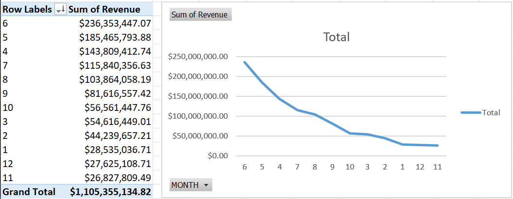{width="6.5in"
height="2.5277777777777777in"}*Figure 1 Line graph with the sum of
revenue for each month*

Analyzing the above figure can clearly show that month 4,5,6, which is
the second quarter comprising April, May, and June, tops as the most
revenue-generating quarter, which in turn says that the summer is
popular for generating a high return on investments

### 1.3.2 What is the average Revenue per customer??

In the same pivot table, the pivot field month is replaced with
'CustDescr' in the rows of the pivot table, adding revenue to the
values. Then, the summary is changed to average, and a pivot chart in
the form of a Bar graph is added to visualize

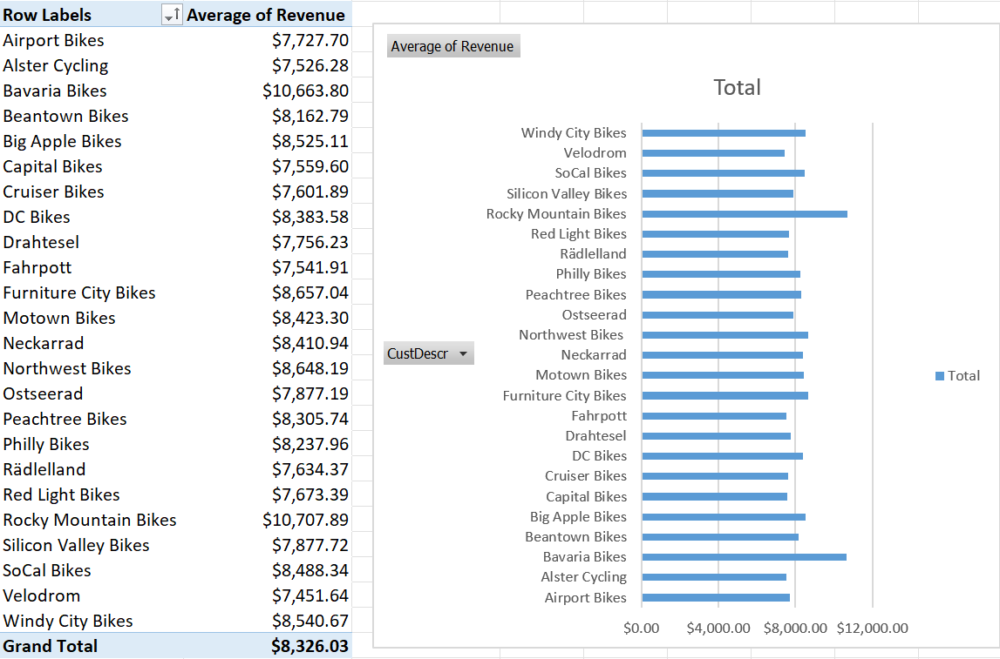{width="5.304610673665792in"
height="2.609002624671916in"}

*Fig 2 Bar graph showing the average revenue of each customer.*

The above graph shows that Bavaria bikes and Rocky Mountain bikes are
the most revenue-generating customers.

### 1.3.3 Based on the dataset, which country has generated the least revenue in the latest year?

In the same pivot table, pivot fields 'YEAR' and 'Country' are added in
the rows of the pivot table, and 'YEAR' is sorted descending and
filtered to the top value to get the latest year in the dataset. Revenue
is added to the values. Then, a pie chart is used to visualize the
result.

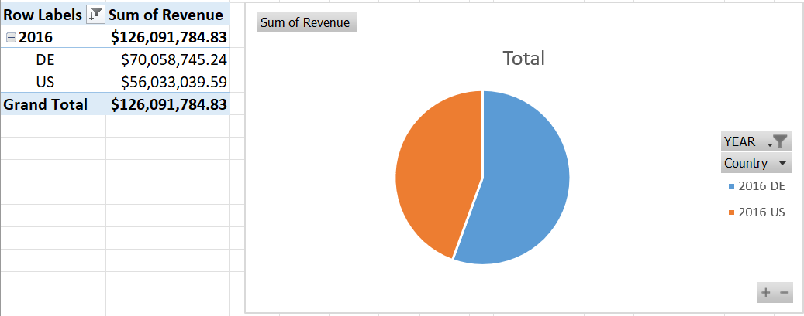{width="5.515625546806649in"
height="2.1834656605424323in"}

*Figure 3 Pie chart with the US as the least sum of revenue*

With the help of Figure 3, we can see that the US is the least
revenue-generating country.

### 1.3.4 Which division has the lowest revenue in the year with the highest revenue?

The pivot fields 'YEAR' and 'Division' are added to the rows, and then
the revenue is added to the values and then the row 'Year' is sorted
from the highest revenue to the lowest, and the row field 'DIVISION' is
sorted vice versa as given in the below figure 4.

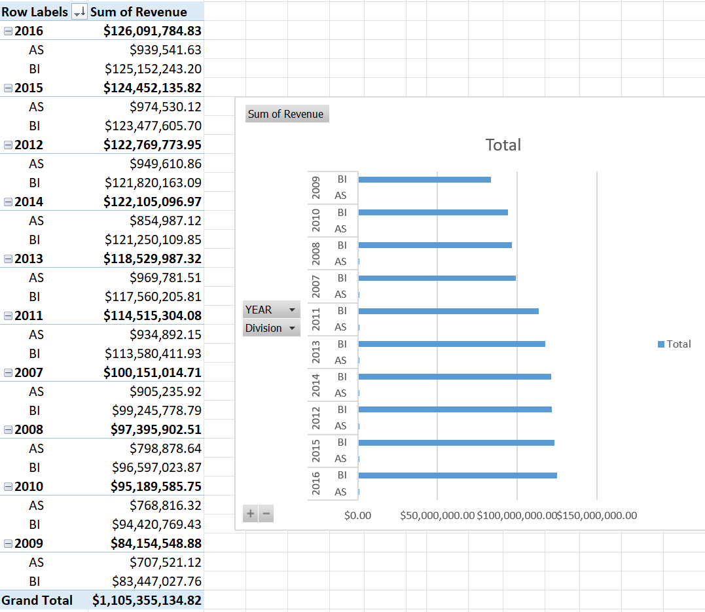{width="4.255208880139983in" height="2.4375in"}

*Figure 4 shows the lowest revenue-generating division in the highest
revenue-generated year.*

## 1.4 Analysis and Critique of the Tool

Excel pivot tables are easy to use and allow for experimentation without
overwhelming complexity. It\'s easy to browse between charts, get
insights, customize table formats, and apply filters and computations.
Excel automatically suggests values, rows, and columns based on parent
table analysis, which I found amusing. It made it easy to classify the
fields.

One drawback of pivot tables is that they can grow complicated and
difficult to understand. With a huge quantity of data and several
fields, it might be challenging to understand the relationships between
pivot table parts. Additionally, editing the representation is
complicated.

## 1.5 Conclusion

Excel pivot tables are valuable for data analysis but may not be
appropriate for all datasets. Before employing a pivot table for data
analysis, it\'s crucial to assess the structure of your data and
determine if it\'s the right tool for your purposes. For further
in-depth analysis, consider alternatives to Excel pivot tables, which
are quite resilient and can scale.

# Chapter 2 SAP Analytics Cloud (SAC)

## 2.1 About SAP Analytics cloud

SAP Analytics Cloud is a cloud-based analytics platform that helps
organizations make better business decisions through data-driven
insights. It connects to many data sources, including spreadsheets,
databases, and cloud apps, allowing for interactive visualizations,
reports, and dashboards.

It enables us to study data, detect trends, and estimate future
consequences. The platform provides tools for preparing data for
modeling, predictive analytics, and machine learning. Since it is a
cloud-based platform, we may also collaborate and exchange findings with
other team members.

## 2.2 Dataset and Research Questions

A dataset was provided in class by Professor Kyung Lee as an Excel
spreadsheet '*GB_AnalyticsData.xlsx*.' This dataset is of a fictitious
company called 'Global Bike Inc (GBI),' and it has over 25 columns of
examineable variables such as revenue, sales, year, products, discounts,
and customer information.

-   The dataset ranges from the year 2007 to 2019

-   It has a total of 171,010 records.

With the following dataset and the help of SAP Analytics Cloud, the
following methodologies will be used to create a viable data model with
star schema by preprocessing the data and building relationships among
them.

## 2.3 Applying the analytical tool and results

1.  Log in to SAP Analytics Cloud, Go to Modeler, and create a new
    classic model with data from a local file.

2.  Select the file GB_AnalyticsData.xlsx and import the first
    worksheet, SalesdataAct.

3.  Create a transformation to concatenate the year, month, and day
    columns into a date dimension.

4.  Change the Customer and Product data type to generic dimensions and
    add attributes from the other columns to help build the
    relationship.

> 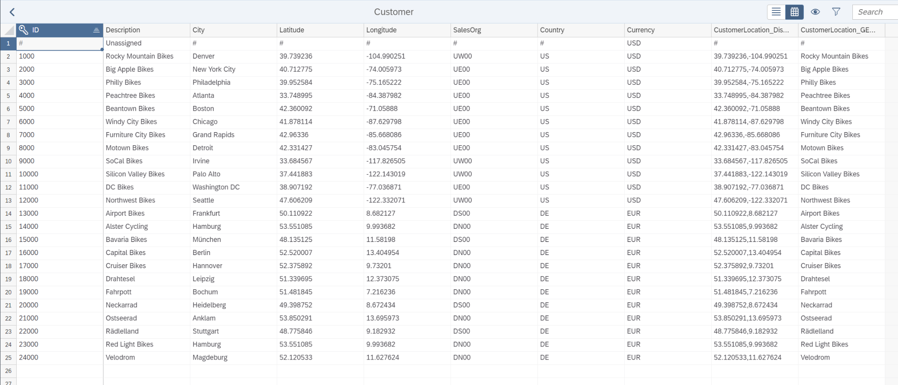{width="6.5in"
> height="0.7456878827646544in"}*Figure 5 Attributes added to the
> Customer dimension*
>
> 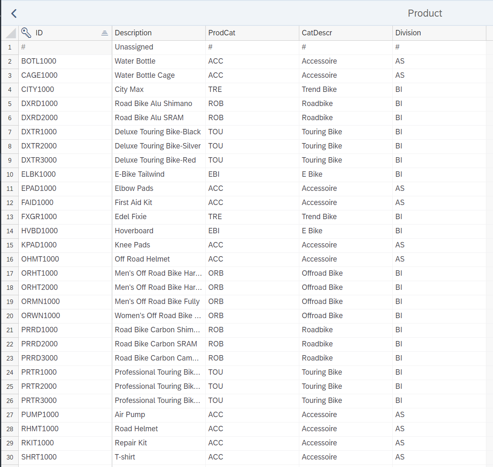{width="6.5in" height="1.65625in"}*Figure 6
> Attributes added to the Product dimension*

5.  Delete unnecessary columns like the UnitOfMeasure column as they are
    unnecessary due to the redundant values.

6.  Use appropriate columns to create level-based hierarchies for
    Customers (figure 7) and Product dimensions (figure 8).

> 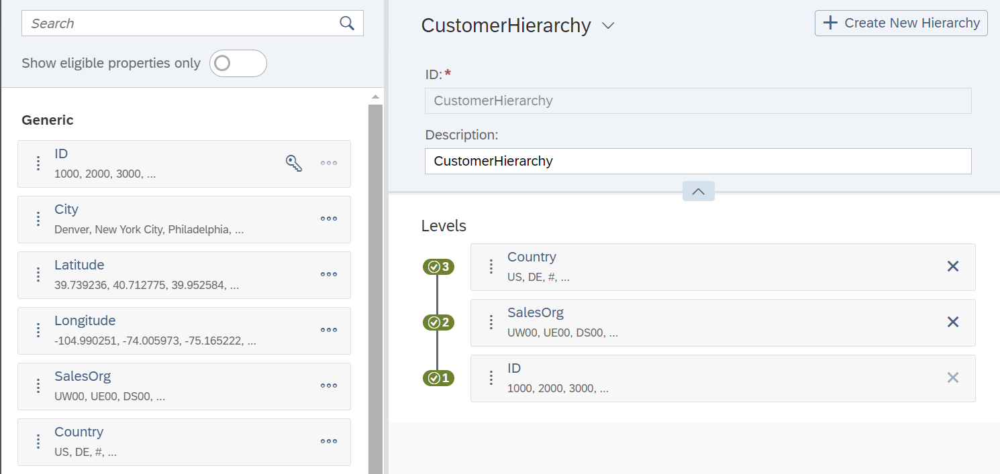{width="5.536458880139983in"
> height="2.6262685914260717in"}*Figure 7 level-based hierarchy on the
> columns Customer ID, SalesOrg, and Country of a customer dimension*
>
> 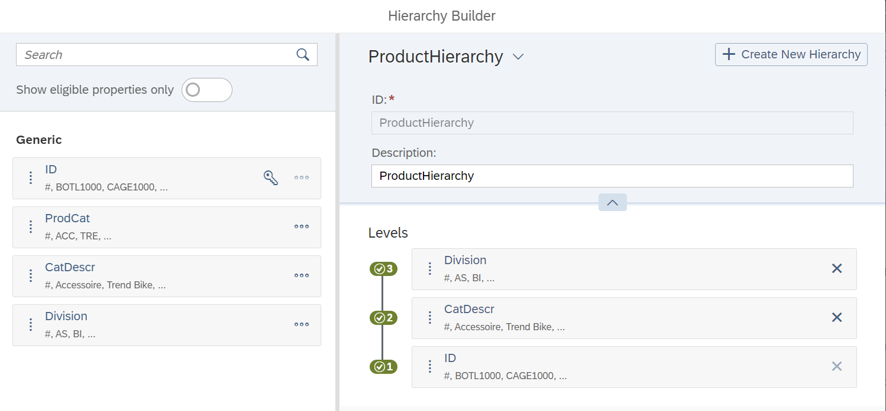{width="5.911458880139983in"
> height="2.778707349081365in"}*Figure 8 level-based hierarchy on the
> columns product ID, product category description, and division of
> product dimension*

7.  Add a geo-enrichment to the Customer dimension based on latitude and
    longitude coordinates, and SAC automatically detects the coordinates
    and creates a new column.

8.  Create the model and name it 'GlobalBikes.\' Save the model to your
    folder and check the data foundation view to see the star schema of
    the model (figure 9).

> 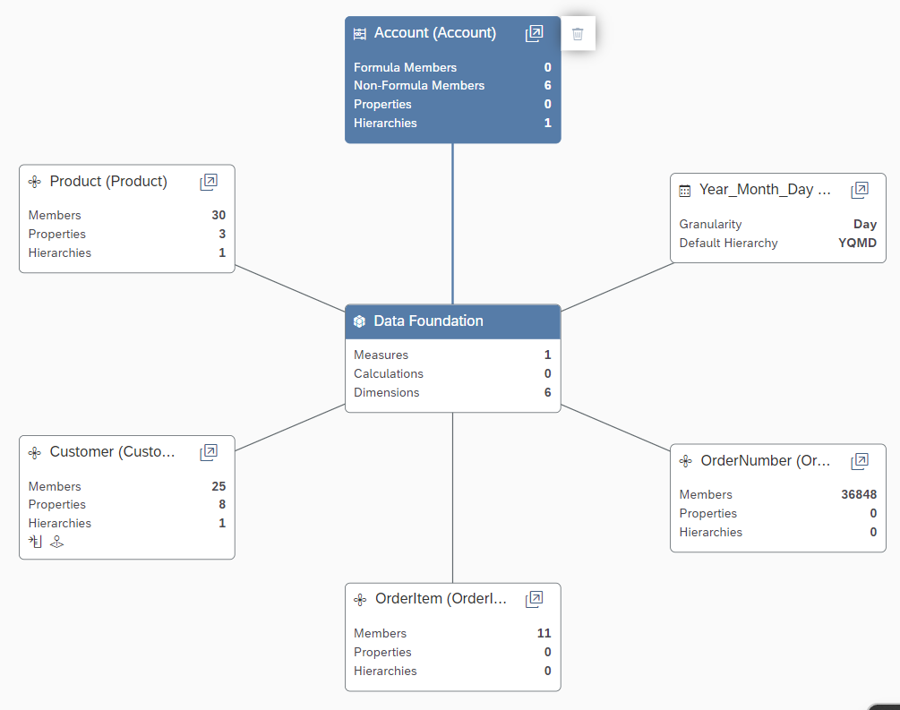{width="4.619792213473316in"
> height="3.553685476815398in"}
>
> *Figure 9 star schema of the GB_AnalyticsData.xlsx.*

9.  Fine-tune the measures by adding currency labels, units, and decimal
    places as needed.

10. Define the default currency as USD for the Currency dimension and
    Save the model.

## 2.4 Analysis and critique of the tool

SAC is a cloud-based program hence, it is highly scalable, readily
available, and can be used by businesses of different sizes at varying
budgets to analyze small to mid enterprise-level data. Team-wise cloud
collaboration is possible, which was lacking in the Excel pivot table.
It has a very easy way of creating a star schema to understand and
analyze fact and dimension tables in any given dataset. Another key
feature is the ability to process the data for cleaning. It is versatile
and comes in handy for quick datatype changes of a certain column for
formatting it.

## 2.5 Conclusion

In conclusion, Sap Analytics Cloud is according to me by far one of the
best upgrades for Excel Pivot tables for its key features, such as being
portable, scalable, and collaborative. It has the ability to suggest
relationships with just headers and extensive analysis capabilities. In
conclusion, SAP Analytics Cloud is a useful analytics tool with its
cloud-based architecture, but it doesn\'t have very good integrations,
making it a single tool with limited capabilities.

# Chapter 3 Tableau

## 3.1 About Tableau

Tableau is a business intelligence (BI) and data visualization software
application. It lets you connect to your data, visualize it, and build
readily available dashboards and reports. Tableau\'s drag-and-drop
interface helps users generate charts, graphs, maps, and other visual
components from their data, making it accessible to those with various
technical backgrounds. It also includes tools for data exploration and
analysis. One of the most powerful features is its partial data cleaning
and pivot. It is used to summarize and visualize huge amounts of data
with the ability to interchange rows and columns to get meaningful
insights from the source data. Another key thing is its ability to add
filters to the data easily for more detailed analysis.

## 3.2 Dataset and Research Questions

Professor Kyung Lee provided a dataset in class as an Excel spreadsheet.
This dataset contains the CO2 emissions of World countries, with
multiple spreadsheets describing various information, such as the
country\'s metadata, cleaned data, raw data, etc.

-   The dataset ranges from the year 1970 to 2011

-   Partial data cleaning using a Data Interpreter is required.

The following research questions will be answered using the following
dataset and Tableau.

1.  Based on the dataset, what are the average CO2 emissions of
    countries of various income groups?

2.  What is the trend of CO2 emission by Australia, India, the United
    Kingdom, Canada, and Saudi Arabia for each decade between 1970 and
    2011?

3.  Based on the dataset, which countries generated the most CO2 between
    1970 and 2011?

## 3.3 Applying the analytical tool and results

### 3.3.1 Based on the dataset, what are the average CO2 emissions of countries of various income groups?

The CO2 per capita and Metadata (countries) spreadsheets are connected
with country code as a relationship and partially cleaned using
Tableau\'s Data Interpreter. Open the workspace and add the income group
to the columns. Drag and drop to add the Sum of CO2 emissions to rows.
Add the Income group column to the Color tab in the Marks section to
differentiate the color.

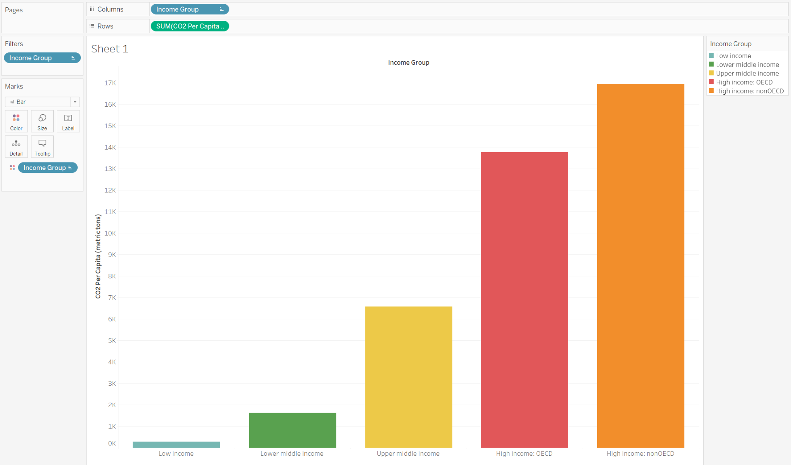{width="6.5in"
height="3.841961942257218in"}*Figure 10 Bar graph with the sum of
revenue for income group countries*

The above figure 10 shows that low-income countries generate less CO2
per capita than higher-income countries. The countries associated with
the Economic Organisation (OECD) have managed to reduce CO2 per capita,
while non-OECD members need help to contain the emissions.

### 3.3.2 What is the trend of average CO2 emission by Australia, India, United Kingdom, Canada, and Saudi Arabia for each decade between 1970 and 2011?

The CO2 Data Cleaned spreadsheet is used and pivoted to get each
selected country\'s appropriate years and carbon emission values. The
years are filtered to the start of each decade, i.e., every ten years,
and only necessary countries for analysis are chosen and filtered.

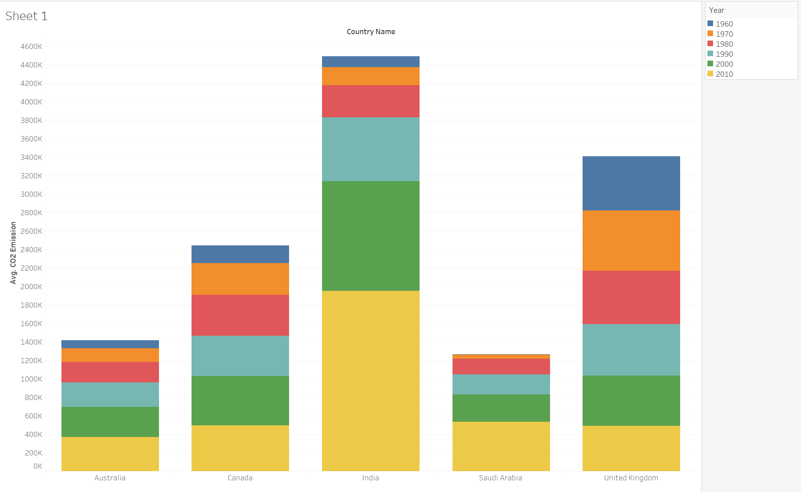{width="6.5in" height="3.236111111111111in"}

*Figure 11 Bar graph showing the average CO2 for specific countries.*

The above figure 11 shows that countries like Canada and the United
Kingdom have managed to reduce their CO2 emissions while countries like
India are increasing their CO2 emissions at an alarming rate every ten
years.

### 3.3.3 Based on the dataset, which countries generated the highest average CO2 per capita between 1970 and 2011?

We use the CO2 Data Cleaned, and then longitude is used in columns and
Latitude in rows to get the world map. We use Average CO2 per capita as
the size, and the counties are used as the details. The color of the
marks in the map is changed to Red and Black, and then the final
visualization is achieved, as shown in Figure 3 below.

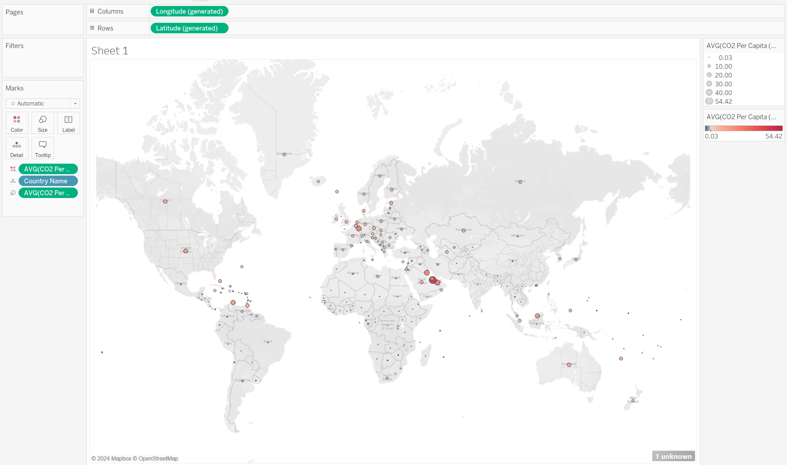{width="5.515625546806649in"
height="2.1834656605424323in"}

*Figure 12 World map with Average CO2 per capita as different-sized
ellipses*

With the help of Figure 12, we can visualize that the biggest and most
prominent circle is on the country Qatar, making it the country that
generated the highest average amount of CO2 per capita between 1970 and
2011

## 3.4 Analysis and Critique of the Tool

Tableau has various advantages. Its simple and effective user interface
and drag-and-drop features make it easy for the user to get started with
it without extensive knowledge. It has all the features, such as partial
data cleaning and pivoting, but there are fewer customization options,
and it has a very expensive license. Overall, it is a quick go-to tool
for data analysis and visualization for easier and more robust results.

## 3.5 Conclusion

Tableau is valuable for its cloud feature, which allows you to save and
access your reports anywhere at any time. It is also known for its
interactivity and dashboard for business intelligence capabilities.

# Chapter 4 Data Cleansing and Wrangling (AQUASTAT)

## 4.1 About Excel and SAP Analytics Cloud

Microsoft Excel is used for its cleaning capabilities and its pivot
tables. It is used to summarize and visualize huge amounts of data very
efficiently giving some easier access to primary data cleaning. It has
flexibility where one can interchange rows and columns to get meaningful
insights from the source data. Another key thing is its ability to add
filters to the data easily for more detailed analysis. We can also use
pivot tables to group the data and sort the data in a matter of clicks.
It is simple yet has robust features, making it one of the cheap and
ideal tools for business intelligence.

SAP Analytics Cloud is a cloud-based analytics platform that helps
organizations make better business decisions through data-driven
insights. It connects to many data sources, including spreadsheets,
databases, and cloud apps, allowing for interactive visualizations,
reports, and dashboards.

## 4.2 Dataset and Research Questions

A dataset was obtained from fao.org/aquastat as an Excel spreadsheet,
'*Aquastat Dissemination System.xlsx*.' Here, we choose only the
necessary data for the purpose of cleaning and analyzing. It is
recommended to select non-absolute values for certain measures, such as
indices or percentages, instead of absolute values.

-   The dataset ranges from the year 2009 to 2020

With the following dataset and the help of Excel and SAP Analytics
Cloud, the data will be cleaned and structured based on our analytics
questions and will be visualized.

The following research questions will be answered using the following
dataset and Tableau.

1.  Based on the dataset, compare the GDP per capita for Argentina,
    Russia, Thailand, Egypt, and India countries with its Gender
    Inequality index.

2.  What is the year-wise percentage of area equipped for irrigation
    with groundwater and the total percentage of area actually irrigated
    are irrigated.

## 4.3 Applying the analytical tool and results

On the website fao.org/aquastat, choose a database, select the year
range and the necessary dataset that we want to explore and analyze, and
download the file as an xlsx file as given in Figure 13.

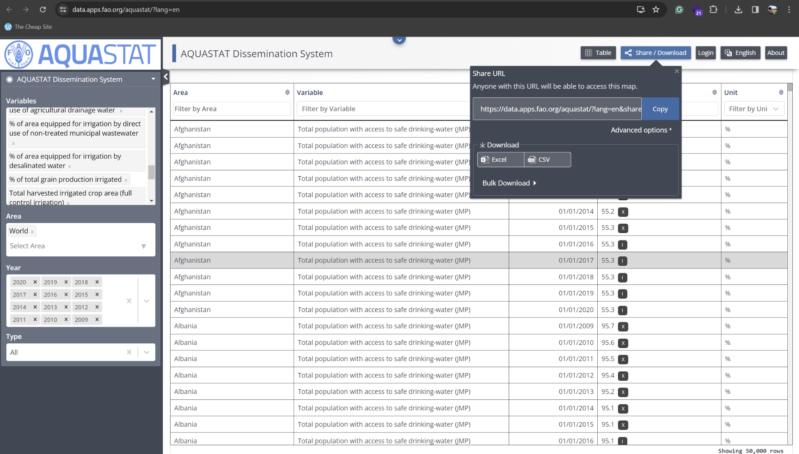{width="6.5in"
height="3.0700995188101485in"}*Figure 13 Grid view of the dataset on the
Aquastat website.*

Insert the pivot table with country and year as columns and variables as
rows, as given in Figure 14.

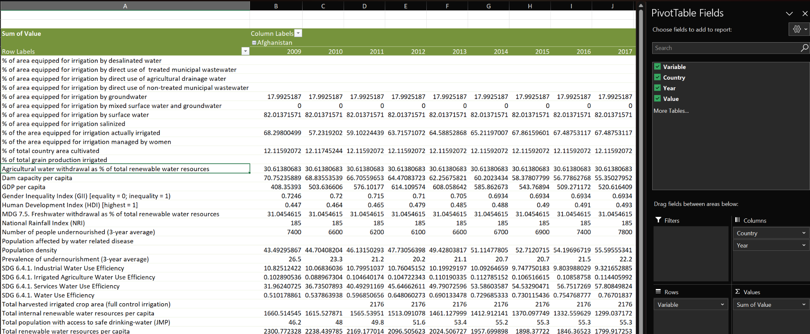{width="6.355089676290464in"
height="2.625in"}*Figure 14 Pivot table from the dataset*

Copy the pivot table, paste it into a new sheet, delete unnecessary rows
and sets of countries with blank values, and sort them by country name,
as shown in Figure 15.

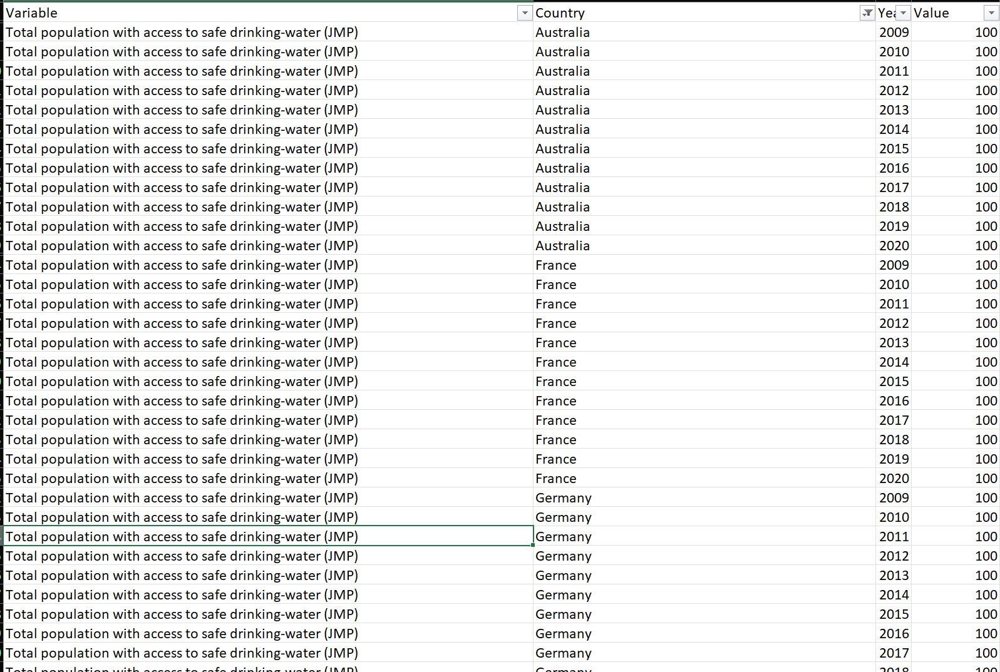{width="5.942708880139983in" height="2.625in"}

*Figure 15 New table from the pivot table of the original dataset.*

Filter the countries taken for analysis (Egypt, Argentina, India,
Russia, Thailand) and load them to SAC for Analysis. The dataset allows
us to compare the GDP per capita of Argentina, Russia, Thailand, Egypt,
and India with their Gender Inequality index.

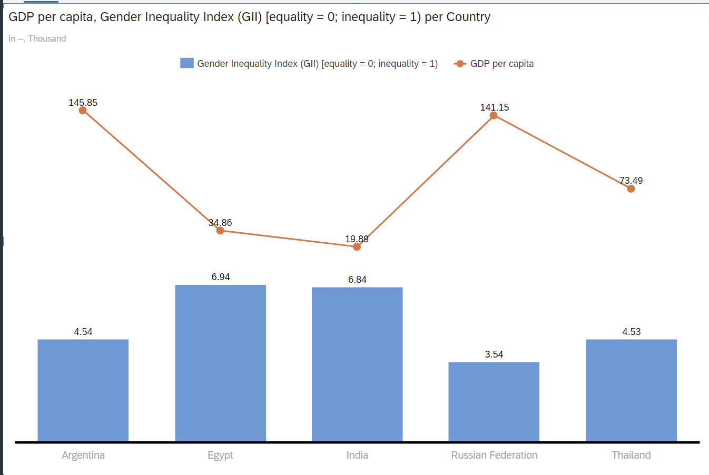{width="6.265625546806649in" height="3.0in"}

*Figure 16. GDP per capita with GII per country.*

Figure 16 tells us that the countries with a very high rate of gender
inequality have the lowest GDP per capita, indicating their
underdevelopment from both economic and moral perspectives.

Then, we can choose the comparison chart. Using the country as a
trellis, we can get the year-wise percentage of the area equipped for
irrigation with groundwater and the total percentage of area irrigated
each year from 2009 to 2020 (figure 17).

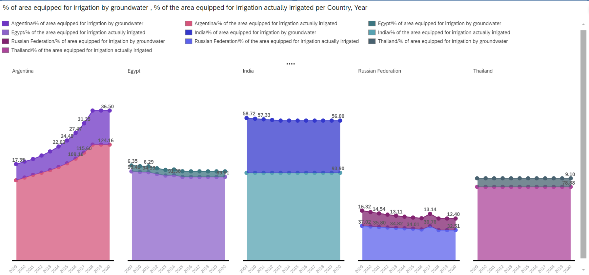{width="6.361111111111111in"
height="2.9786646981627296in"}*Figure 17. Country wise % of the area for
irrigation by groundwater and actually irrigated*

**4.4 Analysis and critique of the tool**

Data cleaning and wrangling structured data with the help of pivot
tables using Excel is a convenient way that does not involve complicated
tasks. We use SAC for visualizing the cleaned and normalized data. SAC
is a cloud-based program; hence, it is highly scalable, readily
available, and can be used by businesses of different sizes at varying
budgets to analyze small to mid-enterprise-level data. Team-wise cloud
collaboration is possible, which needs to be improved in the Excel pivot
table.

## 4.5 Conclusion

In conclusion, the combination of both Excel and SAC is a robust way to
use Microsoft Excel for Foundational data cleaning and wrangling based
on our business and analysis requirements. Even though it is very useful
for data cleansing and wrangling with Excel still, SAC is suited for its
advanced visualization capabilities.

# Chapter 5 SAP Crystal Reports

## 5.1 About SAP Crystal Reports

SAP Crystal Reports is a powerful tool for creating dynamic reports from
real-time data. The reports generated by these are highly formatted and
customized and also support various data sources. The ability to connect
a real-time database to a reporting dashboard paves the way for
reporting streaming data pipelines.

## 5.2 Dataset and Research Questions

A dataset was accessed from the SAP BW Belfast server with the necessary
login credentials, and this server can be directly connected to the SAP
Crystal Reports. Here, we choose only the necessary data for cleaning
and reporting. We will be deriving a Sales revenue report for Global
Bike sales from the given dataset to get the Subtotal of revenue
generated and also year-by-year bicycle revenue grouped by country.

## 5.3 Applying the analytical tool and results

We create a new blank report, establish a new connection to our SAP BW
Belfast Server, and access our database. Then, we choose the necessary
variables, filter only Bicycles from the product, and use them in the
report by dragging and dropping to the report\'s appropriate position in
the design panel Figure 18.

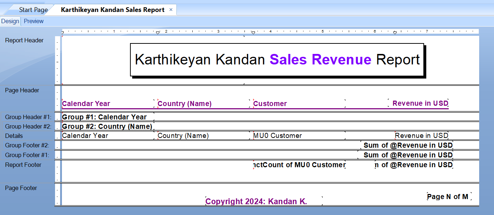{width="6.361111111111111in"
height="2.9786646981627296in"}*Figure 18. Design panel view of the sales
report*

We also format the revenue column to format it to currency type and also
another formula to convert euros to dollars. Finally, we grouped the
report based on the year and the country. We also summarize the revenue
to get the grouped sub-total and the overall total revenue in sales for
the bicycle category, as shown in Figure 19.

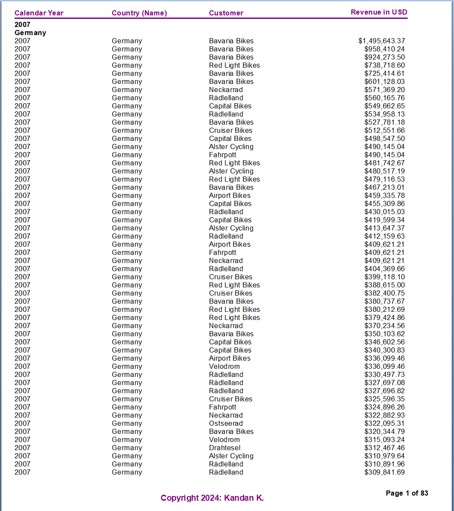{width="5.276042213473316in"
height="4.206434820647419in"}

*Figure 19. Final sales revenue report in the preview*

## 5.4 Analysis and critique of the tool

I found SAP Crystal reports similar to the ZOHO or Hubspot CRMs but way
more advanced and technologically strong. How we can connect a database
to get real-time on-demand reporting is always a great and added
advantage for any business intelligence requirements. It is intuitive
and quite user-friendly to generate reports, and it also runs locally.
One major disadvantage is that the data we feed must be clean, as it
does not have thorough data-cleaning capabilities

## 5.5 Conclusion

In conclusion, SAP Crystal reports are one of the fastest, easiest, and
most efficient ways of generating real-time enterprise-level reports
that involve large quantities of data, provided the data is normalized
to reduce any significant errors in the reports. The formatting
capabilities make it one of the most user-friendly tools for creating
enterprise-level reports.

# Chapter 6 Tableau and Netlytic for Sentiment Analysis

## 6.1 About Tableau

Tableau is a business intelligence (BI) and data visualization software
application. It lets you connect to your data, visualize it, and build
readily available dashboards and reports. Tableau\'s drag-and-drop
interface helps users generate charts, graphs, maps, and other visual
components from their data, making it accessible to those with various
technical backgrounds. It also includes tools for data exploration and
analysis. It is used to summarize and visualize vast amounts of data
with the ability to interchange rows and columns to get meaningful
insights from the source data. Another key thing is its ability to add
filters to the data easily for more detailed analysis.

For sentiment Analysis, we use Netlytic, a specialized cloud-based text
analysis tool for processing large volumes of textual data. Since it is
a text-based analysis tool, it offers out-of-the-box text summarization
and compatibility with several dataset-uploading formats. It also
supports open-source social media and other datasets, which can be
pulled, and processed and get the dataset ready for injection into any
analysis tool.

## 6.2 Dataset and Research Questions

The original dataset has been downloaded from a data portal called
Kaggle, https://www.kaggle.com/zynicide/wine-reviews. This dataset
contains about 130,000 wine reviews with the following dimensions:
country, province, description, rating points, price, title, variety,
and winery. Professor Kyung Lee provided the reduced dataset in class as
a comma-separated Excel spreadsheet with 6000 points and reduced
variables or columns.

The following research questions will be answered using the following
dataset, Tableau and Netlytic.

1.  Which country has the highest average price of wine?

2.  What are the top 3 most used keywords in the overall wine review?

3.  What are all the top 10 negative reviews?

4.  What are all the top 10 positive reviews?

## 6.3 Applying the analytical tool and results

### 6.3.1 Which country has the highest average price of wine?

The dataset was imported and then tableau has the ability to generate
Geography map and with that we use average price as the key variable and
generate a Geo-map Chart.

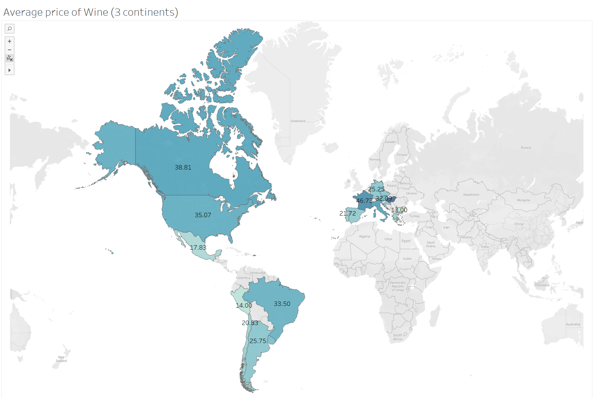{width="6.5in"
height="4.367012248468941in"}*Figure 20*

With the above chart, we get figure 20 which reveals that Hungary in
Europe has the most expensive wine pricing, with an average of 59.87
dollars.

### 6.3.2 What are the top 3 most used keywords in the overall wine review?

For this, we use the netlytic tool to preprocess the data to get a bag
of words from the dataset containing wine reviews. The bag of words will
then be imported onto Tableau for analysis.

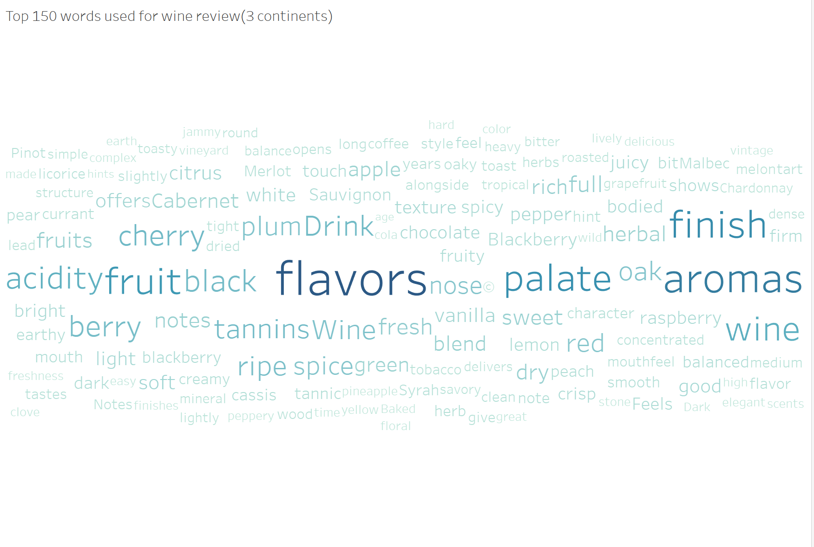{width="6.515625546806649in" height="3.25in"}

*Figure 21 Bar graph showing the average CO2 for specific countries.*

Figure 21 above shows that 'Flavour', 'Aromas', and 'Finish' are the top
3 most used keywords in the reviews from the given dataset.

### 6.3.3 What are all the top 10 negative reviews??

We use the same wine reviews dataset and import the polarity scores to
the tableau for the sentiment analysis.

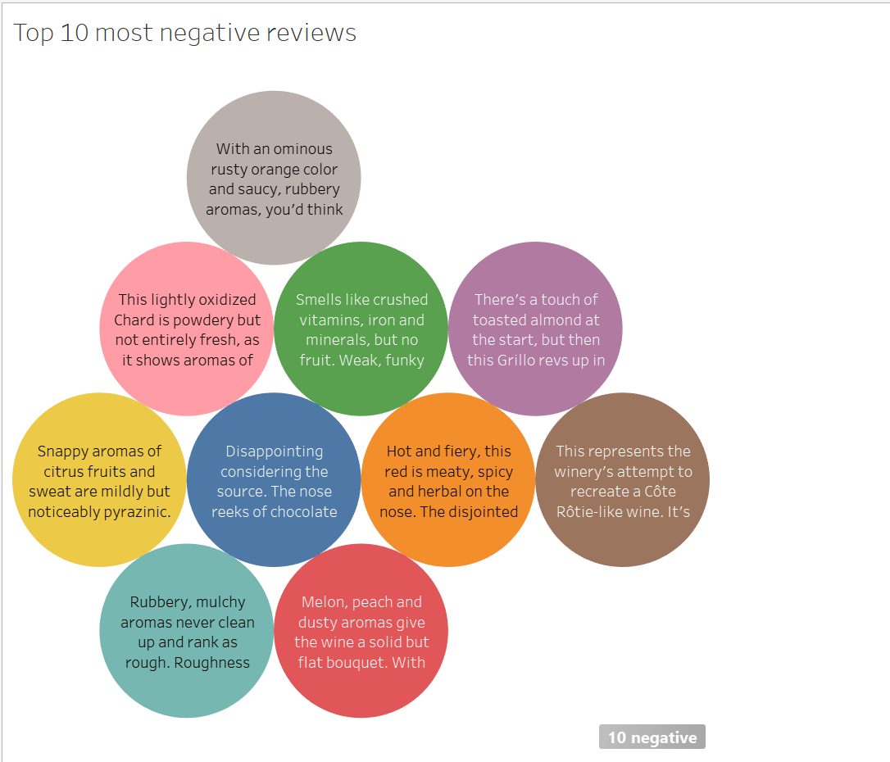{width="4.536458880139983in"
height="3.254633639545057in"}

*Figure 22 Top 10 most negative reviews*

Figure 22 helps us obtain the most negative reviews from the dataset,
and we can see that the most negative reviews concern the quality of the
wine, especially its aromas.

## 6.4 Analysis and Critique of the Tool

Even with its visualisation capabilities, Tableau doesn\'t have many
data processing capabilities, such as collecting a bag of words, etc.,
but in combination with other tools such as Netlytic, it can be of good
use. Netlytic is also to be praised for its motive of focussing on
text-based data analysis while being open-source.

**6.5 Conclusion**

Tableau is valuable for its cloud feature, which allows you to save and
access your reports anywhere at any time with its robust visualization
capabilities, but when it comes to data mining, it certainly needs to be
worked along with other tools due to its unavailable capabilities of
preparing the data.

# Chapter 7 SAP Analytics cloud - Predictive Analytics Scenarios

## 7.1 SAP Analytics Cloud

A predictive analytics tool in SAP Analytics Cloud (SAC) may help
businesses project the future using historical data. Along with offering
suggestions for improving outcomes, the program could also identify
important factors that affect company performance with the ability to
create custom predictive models utilizing a variety of algorithms which
aids in identifying the most important variables for prediction.

## 7.2 Dataset and Research Questions

The data set was made available on Brightspace as an Excel spreadsheet
with the file name GBSales_Transactions.xlsx which has five columns with
variables that can be examined: Year, Month, Date, Revenue, and
Currency. The collection contains 171,010 records of sales data from
Global Bike, a company that manufactures bicycles, for the years 2008
through 2020.

The following research questions will be answered with Year, month, day,
and currency are the parameters, and revenue as the measure.

1.  What are the forecasted sales for December 2021 in Germany?

2.  Which month is expected to see the highest sales in the next 2
    years?

3.  What has the most significant impact on the forecast of sales?

4.  Which month has the highest impact on the cycle in terms of
    forecast?

## 7.3 Applying the analytical tool and results

### 7.3.1 What are the forecasted sales for December 2021 in the U.S.?

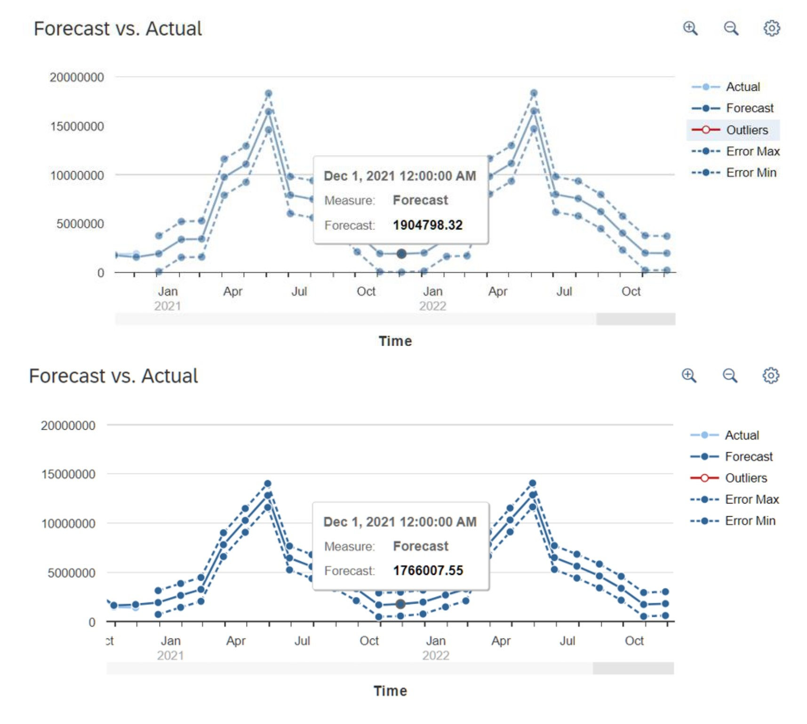{width="6.5in" height="3.0in"}*Figure 23 Grid
view of the dataset on the Aquastat website.*

The above line graph visualizes the forecasted sales in the US. Revenue
is expected to reach around 1904800 USD by December 1, 2021.

### 7.3.2 Which month is expected to see the highest sales in the next 2 years? 

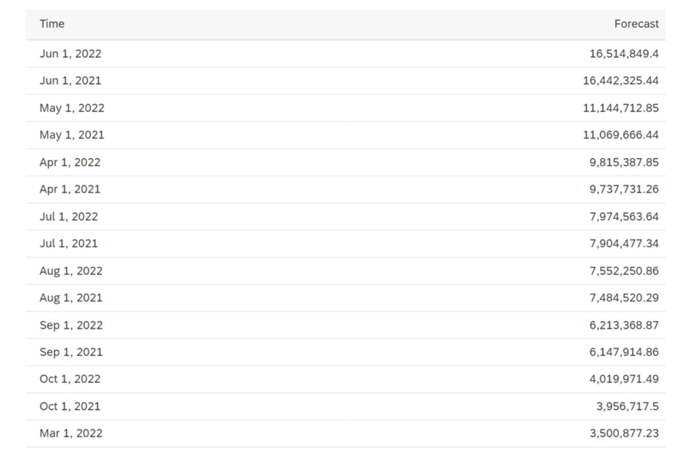{width="6.354166666666667in"
height="3.2343755468066493in"}*Figure 24 Pivot table from the dataset*

The top 15 months with the highest predicted revenue have been ranked
and shown and with the help of the figure we can see that 16,514,894.4
USD, June 1, 2022 is predicted to have the highest revenue in terms of
sales. Note to be taken that this analysis is done keeping 2 years of
2021 and 2022 in mind

### 7.3.4 Which month has the highest impact on the cycle in terms of forecast?

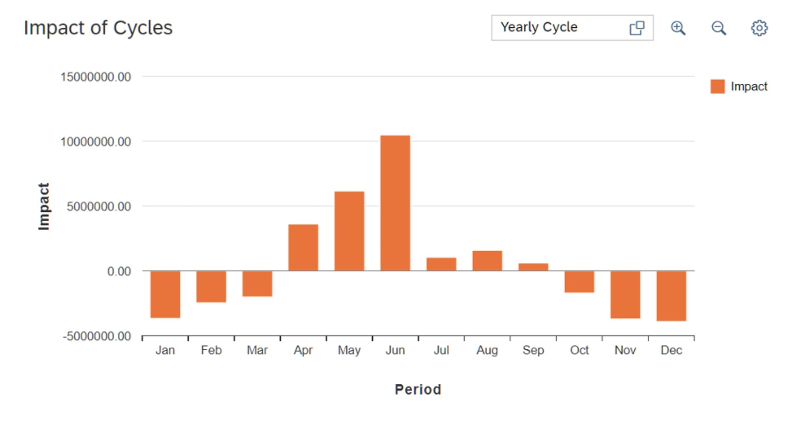{width="5.942708880139983in"
height="3.136940069991251in"}

*Figure 25 Impact of cycles from the month of January to December.*

Figure 25 shows the effect of certain months on the annual cycle. June
consistently has the most significant sales and appears to have the most
influence on the yearly sales cycle in the given period.

## 7.4 Analysis and critique of the tool

SAC has a sophisticated user interface that can be difficult for novice
users to operate. There are many tools and capabilities in the software,
and users may need to invest some time in learning how to use them all.
Users who are inexperienced with business intelligence tools or data
analysis may find it more difficult to utilize as a result Especially
the one with the machine leaning or prediction requirements.

## 7.5 Conclusion

SAP Analytics Cloud (SAC) presents itself as a strong analytics option
for companies looking for a cloud-based platform that integrates easily
with the SAP ecosystem. It is a formidable competitor for businesses of
all sizes due to its powerful functionality and user-friendly UI.
Furthermore, SAC\'s venture into machine learning and predictive
analytics enables users to produce insightful forecasts and insights.

It\'s important to recognize, though, that not everyone will be a good
fit for SAC. SAC\'s existing capabilities may not be sufficient for
businesses with highly specialized customisation requirements or those
that rely substantially on a diversified software ecosystem. Prior to
making a final decision, it is advisable to thoroughly assess these
aspects in conjunction with an organization\'s particular requirements.

# Chapter 8 Executive Summary

In today\'s data-rich world, effective business decisions rely heavily
on the insights gleaned from powerful analytics tools. This report
explores a comprehensive toolbox of such tools, including user-friendly
solutions like Excel Pivot Tables and feature-rich platforms like SAP
Lumira Discovery, SAP Predictive Analytics, Tableau, and SAC (including
its predictive analytics module). Each offers unique functionalities and
caters to a variety of analytical tasks.

We leveraged this toolkit to address specific business challenges and
demonstrate the analytical prowess of each tool. Here are some examples:

Sales Optimization for a Bike Company: We unraveled key trends and
patterns within the company\'s sales data by harnessing the power of
Excel Pivot Tables. This enabled us to swiftly analyze, filter, and sort
the data, ultimately generating actionable recommendations to boost
sales.

Business Reports with SAP Crystal reports is one synchronised central
way to actively update reports with streaming data.

Sales and Production Analysis for a Bike Company: Armed with SAC\'s
user-friendly interface and robust analytics engine, we gained valuable
insights into a bike company\'s sales and production data. This analysis
pinpointed areas for improvement, allowing for better decision-making.

Predictive Sales Forecasting: Moving forward, SAP Predictive Analytics
and SAC\'s predictive analytics module were employed to create models
for sales forecasting. These sophisticated models not only provided
estimates for future sales but also highlighted the factors with the
strongest influence. This empowers businesses to refine their marketing
strategies and drive growth.

In conclusion, this versatile toolkit showcases a spectrum of powerful
analytics tools, each contributing valuable insights and showcasing its
distinct strengths. While some solutions prioritize user-friendliness,
others cater to advanced analytics needs. Regardless, this collection
empowers businesses to unlock the potential within their data,
ultimately enabling smarter decision-making. By leveraging the strengths
of each tool, businesses can optimize processes, elevate customer
experiences, and propel themselves toward sustainable growth.

**References**

-   Kalé, N. & Jones, N. (2020). Practical Analytics (2nd ed.). Epistemy
    Press.
